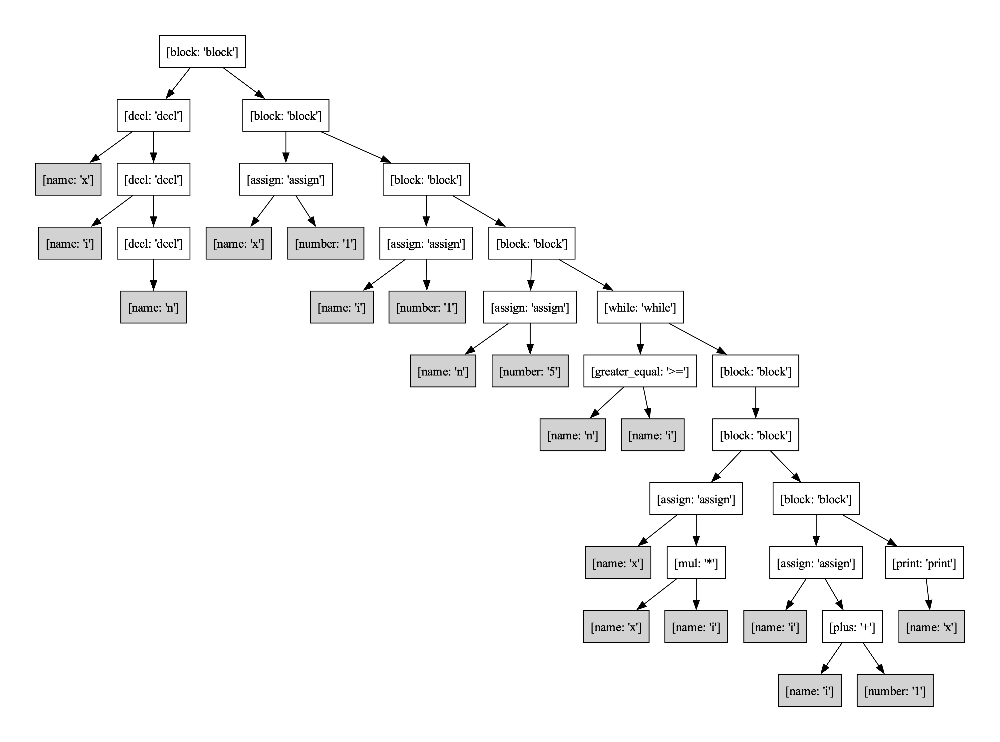

## MiniMiniJava Interpreter
The MiniMiniJava Interpreter is designed to interpret a simplified variant of Java code by deconstructing each stage of the interpretation process. It includes a custom lexer, LR-parser, and interpreter that work together to process code, highlight syntax errors, display syntax trees, and generate a sequence of custom bytecode. This step-by-step visualization provides a deeper understanding of how code is analyzed and executed from beginning to end.
## How to Run 
The program has been tested on macOS.

1. Recommended step: Use a virtual environment 
   ```bash
   python3 -m venv env
   source env/bin/activate
   ```

2. Install dependencies
   ```bash
   pip3 install -r requirements.txt
   ```

3. Run the program
   ```bash
   python3 Main.py
   ```

## Example Execution 
The following example examines the various steps involved in executing a simple program that calculates the factorial of 5 (5!) and prints the result to the console. A detailed description of the syntax supported by the interpreter is available in the final section, ```Mini Mini Java Syntax```.
```
x, i, n;
x = 1;
i = 1;
n = 5;
while (n >= i) {
	x = x * i;
	i = i + 1;
	print(x);
}
```

### 1. Checking the syntax 
Executing the program greets the user with the CLI of the MiniMiniJava Interpreter. 
A program can be loaded in to the application using the command: 
```bash
load [programm]
```
When loading a program with a syntax error, the interpreter will highlight the error.
Suppose a semicolon is missing in the factorial program: 
```
x, i, n;
x = 1;
i = 1;
n = 5;
while (n >= i) {
	x = x * i //; missing
	i = i + 1;
	print(x);
}
```
The program will highlight the error:
```bash
(interp): load fac.txt
x,i,n;
x=1;
i=1;
n=5;
while(n>=i){
x=x*i  <----- Syntax Error
     ^
```
### 2. Rendering the syntax tree
If the program conforms to the syntax, the syntax tree can be printed using the command: 
```bash
render_ast
   ```
For the factorial program this results in the following image:

### 3. Printing the bytecode sequence 
The Interpreter generates a byte code sequence for a syntactically correct program, that closely resembles the real JVM Bytecode. 
The bytecode sequence can be printed to the console with the command: 
```bash
print print_bseq
```
For the factorial program this results in the following output:
```bash 
(interp): print_bseq
_____________________
Local variable table:
Name: n | Value: 0
Name: i | Value: 0
Name: x | Value: 0
_____________________
0 : ('iconst', '1')
1 : ('istore', 'x')
2 : ('iconst', '1')
3 : ('istore', 'i')
4 : ('iconst', '5')
5 : ('istore', 'n')
6 : ('iload', 'n')
7 : ('iload', 'i')
8 : ('icmpge', 1)
9 : ('iload', 'x')
10 : ('iload', 'i')
11 : imul
12 : ('istore', 'x')
13 : ('iload', 'i')
14 : ('iconst', '1')
15 : iadd
16 : ('istore', 'i')
17 : ('iload', 'x')
18 : print
19 : ('goto', 0)
[6, 20]
```


### 4. Executing the factorial program
Lastly, the program can be executed with the command: 
```bash
execute
```
The factorial program will produce the output: 

```bash
(interp): execute 
<print> 1
<print> 2
<print> 6
<print> 24
<print> 120
exit 0
```


## Mini Mini Java Syntax
The Mini-Mini-Java syntax is designed for a simplified version of Java, incorporating fundamental programming constructs while remaining accessible for learners. Key features include:

1. **Binary Operations**: 
   - Supports basic operations: addition (`+`), subtraction (`-`), division (`/`), and multiplication (`*`), allowing for expressive arithmetic.

2. **Declarations**: 
   - Variable declarations are made with names separated by commas, ending with a semicolon, enabling multiple variable declarations in one statement.

3. **Expressions**: 
   - Can be simple (numbers or variable names) or complex combinations connected by binary operations, with parentheses indicating precedence.

4. **Control Flow Statements**: 
   - Includes `if`, `else`, and `while` constructs for conditional and iterative execution, with braces (`(` and `)`) for grouping statements.

5. **Conditionals**: 
   - Conditions use comparison operators like `==` (equality) and `>=` (greater than or equal to) for logical decision-making.

6. **Functionality for Output**: 
   - The `print` statement allows outputting expressions, enhancing interactivity during execution.


```
<PROG> ::= <DECL> <STMT> "$"

<BINOP> ::= "+" 
          | "-" 
          | "/" 
          | "*"

<DECL> ::= <NAME> "," <DECL>  
         | <NAME> ";" 

<EXPR> ::= <NUMBER>
         | <NAME>
         | <EXPR> <BINOP> <EXPR>
         | "(" <EXPR> ")" 

<STMT> ::= <STMT> <STMT>
         | <NAME> "=" <EXPR> ";" 
         | "print" "(" <EXPR> ")" ";" 
         | "while" "(" <COND> ")" <STMT> 
         | "if" "(" <COND> ")" <STMT> 
         | "if" "(" <COND> ")" <STMT> "else" <STMT> 
         | "{" <STMT> "}" 

<COND> ::= "(" <COND> ")" 
         | <EXPR> <COMP> <EXPR>

<COMP> ::= "==" 
         | ">=" 

<NUMBER> ::= [0-9]+                  
<NAME> ::= [a-zA-Z]*   

```
